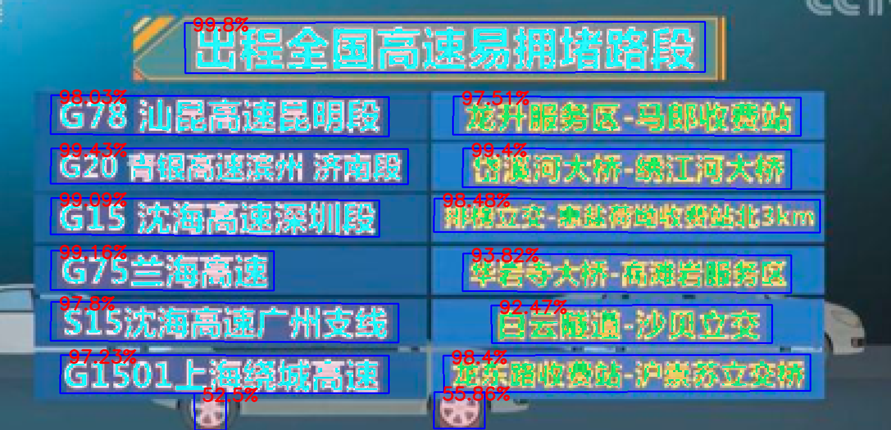

## ocr.pytorch
> A pure pytorch implemented ocr project.  
Still under developing!  
Test codes and training codes for CTPN are available now, training codes for CRNN will come soon. 

## Prerequisite

- python-3.5+
- pytorch-0.4.1+
- torchvision-0.2.1
- opencv-3.4.0.14
- numpy-1.14.3

They could all be installed through pip except pytorch and torchvision. As for pytorch and torchvision, 
they both depends on your CUDA version, you would prefer to reading [pytorch's official site](https://pytorch.org/)

### Detection
Detection is based on [CTPN](https://arxiv.org/abs/1609.03605), some codes are borrowed from 
[pytorch_ctpn](https://github.com/opconty/pytorch_ctpn), several detection results: 

### Recognition
Recognition is based on [CRNN](http://arxiv.org/abs/1507.05717), some codes are borrowed from
[crnn.pytorch](https://github.com/meijieru/crnn.pytorch)

### Test
Download pretrained models from [here](https://pan.baidu.com/s/1yllO9hBF8TgChHJ7i3WobA) (extract code: u2ff)
and put these files into checkpoints.
Then run
>python3 demo.py

The image files in ./test_images will be tested for text detection and recognition, the results will be stored in ./test_result.

If you want to test a single image, run
>python3 test_one.py [filename]

### Train
Training codes are placed into train_code directory.  
Train [CTPN](./train_code/train_ctpn/readme.md)  
Train [CRNN](./train_code/train_crnn/readme.md)  

### Licence
[MIT License](https://opensource.org/licenses/MIT)